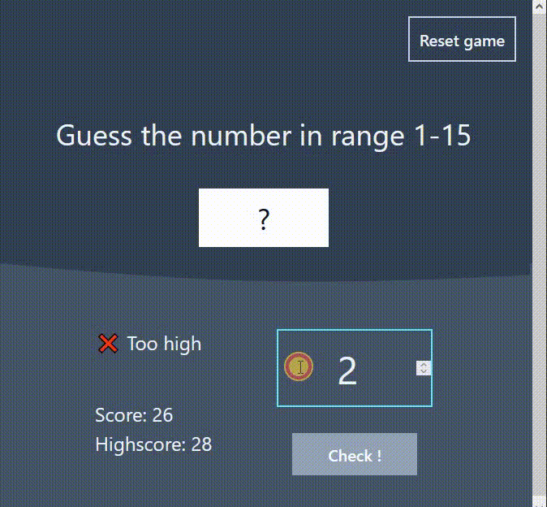

# 🛠 React & Tailwind - guess number game

# 🔗 [Live Preview](https://main--classy-conkies-111e7b.netlify.app/)

## Welcome! 👋

- I made a game using React where you guess a secret number between 1 and 15. The game helped me practice React logic. Although I followed a tutorial for most of it, I also got to experiment with it myself.

---

- You enter a number, and the game tells you if it's too high or too low.

- The game keeps track of how many times you try to guess. You start with a score of 30 and it goes down each time you guess wrong.

- There's a highscore too! It shows your best score, so you can try to beat it.

---

### Languages and features 👨‍💻 

- React: local state management, conditional rendering, if statements
- Tailwind: utility classes

Thanks for checking out my projects.